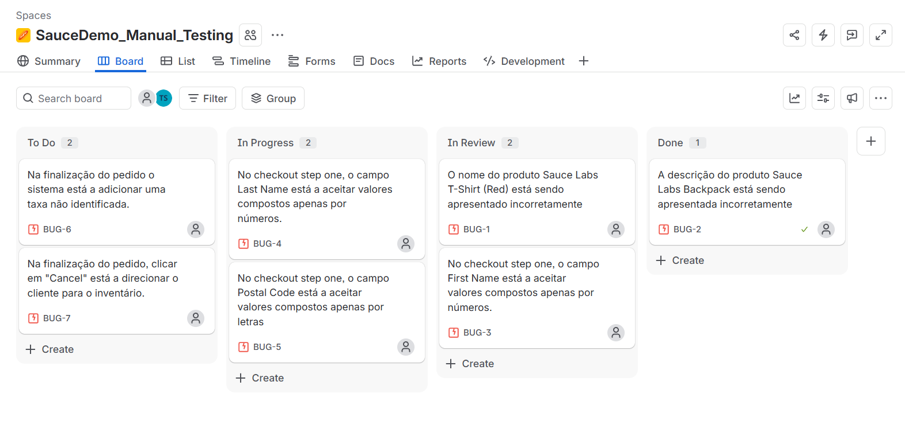

# 4. Manual Test Execution 

## Objetivo
Registar os resultados da execução manual dos casos de teste definidos no projeto **SauceDemo Manual Testing**.

A execução permite verificar o comportamento real da aplicação, identificar desvios em relação aos resultados esperados e documentar as evidências obtidas durante os testes.

## Ambiente de Execução

| Item              | Valor          |
| ----------------- | -------------- |
| Sistema Operativo | Windows 11 Pro |
| Navegador         | Google Chrome  |
| Aplicação         | SauceDemo      |
| Tipo de teste     | Manual         |
| Dispositivo       | Portátil       |

## Status
Cada Test Case será classificado utilizando um dos seguintes status:

| Status      | Significado                                               |
| ----------- | --------------------------------------------------------- |
| **PASS**    | O resultado obtido corresponde ao resultado esperado.     |
| **FAIL**    | O resultado obtido não corresponde ao resultado esperado. |
| **BLOCKED** | O teste não pôde ser executado devido a uma impedimento.  |

# Resultados da Execução

## Login

| Test Case ID | Test Case                            | Status  | Bug ID |
| ------------ | ------------------------------------ | ------- | ------ |
| TC-LOGIN-001 | Login com credenciais válidas        | PASS    | —      |
| TC-LOGIN-002 | Login com username inválido          | PASS    | —      |
| TC-LOGIN-003 | Login com password inválida          | PASS    | —      |
| TC-LOGIN-004 | Login com credenciais inválidas      | PASS    | —      |
| TC-LOGIN-005 | Login com username vazio             | PASS    | —      |
| TC-LOGIN-006 | Login com password vazia             | PASS    | —      |
| TC-LOGIN-007 | Login com username e password vazios | PASS    | —      |
| TC-LOGIN-008 | Login com utilizador bloqueado       | PASS    | —      |
| TC-LOGIN-009 | Ocultação da palavra-passe           | PASS    | —      |
| TC-LOGIN-010 | Logout de utilizador autenticado     | PASS    | —      |

## Inventory

| Test Case ID | Test Case                                           | Status  | Bug ID  |
| ------------ | --------------------------------------------------- | ------- | ------- |
| TC-INV-001   | Acesso à página de produtos após login              | PASS    | —       |
| TC-INV-002   | Visualização do nome dos produtos                   | FAIL    | BUG-001 |
| TC-INV-002   | Visualização da descrição dos produtos              | FAIL    | BUG-002 |
| TC-INV-002   | Visualização do preço dos produtos                  | PASS    | —       |
| TC-INV-002   | Visualização das imagens dos produtos               | PASS    | —       |
| TC-INV-003   | Ordenação dos produtos por nome — A a Z             | PASS    | —       |
| TC-INV-004   | Ordenação dos produtos por nome — Z a A             | PASS    | —       |
| TC-INV-005   | Ordenação dos produtos por preço — menor para maior | PASS    | —       |
| TC-INV-006   | Ordenação dos produtos por preço — maior para menor | PASS    | —       |
| TC-INV-007   | Adicionar um produto ao carrinho                    | PASS    | —       |
| TC-INV-008   | Adicionar múltiplos produtos ao carrinho            | PASS    | —       |
| TC-INV-009   | Remover produto diretamente da página de produtos   | PASS    | —       |
| TC-INV-010   | Acesso ao carrinho a partir da página de produtos   | PASS    | —       |

## Cart

| Test Case ID | Test Case                                            | Status  | Bug ID |
| ------------ | ---------------------------------------------------- | ------- | ------ |
| TC-CART-001  | Visualização de produto no carrinho                  | PASS    | —      |
| TC-CART-002  | Remover um produto do carrinho                       | PASS    | —      |
| TC-CART-003  | Alterar a quantidade do produto a partir do carrinho | BLOCKED | —      |
| TC-CART-004  | Acessar o produto a partir do carrinho               | PASS    | —      |
| TC-CART-005  | Continuar compras a partir do carrinho               | PASS    | —      |
| TC-CART-006  | Remover todos os produtos do carrinho                | PASS    | —      |
| TC-CART-007  | Visualização do carrinho vazio                       | PASS    | —      |
| TC-CART-008  | Continuar compras com carrinho vazio                 | PASS    | —      |
| TC-CART-009  | Iniciar checkout a partir do carrinho                | PASS    | —      |

## Checkout

| Test Case ID | Test Case                                                         | Status  | Bug ID  |
| ------------ | ----------------------------------------------------------------- | ------- | ------- |
| TC-CHECK-001 | Exibição da primeira etapa do checkout                            | PASS    | —       |
| TC-CHECK-002 | Campo "First Name" vazio no checkout step one                     | PASS    | —       |
| TC-CHECK-003 | Campo "First Name" somente com números no checkout step one       | FAIL    | BUG-003 |
| TC-CHECK-004 | Campo "Last Name" vazio no checkout step one                      | PASS    | —       |
| TC-CHECK-005 | Campo "Last Name" somente com números no checkout step one        | FAIL    | BUG-004 |
| TC-CHECK-006 | Campo "Zip/Postal Code" vazio no checkout step one                | PASS    | —       |
| TC-CHECK-007 | Campo "Zip/Postal Code" somente com letras no checkout step one   | FAIL    | BUG-005 |
| TC-CHECK-008 | Todos os campos obrigatórios vazios no checkout step one          | PASS    | —       |
| TC-CHECK-009 | Preenchimento válido de todas as informações no checkout step one | PASS    | —       |
| TC-CHECK-010 | Cancelar checkout no step one                                     | PASS    | —       |
| TC-CHECK-011 | Visualização dos produtos no checkout step two                    | PASS    | —       |
| TC-CHECK-012 | Validação dos valores no checkout step two                        | FAIL    | BUG-006 |
| TC-CHECK-013 | Retornar ao step one a partir do step two                         | BLOCKED | —       |
| TC-CHECK-014 | Cancelar checkout na etapa checkout step two                      | FAIL    | BUG-007 |
| TC-CHECK-015 | Conclusão de uma compra                                           | PASS    | —       |
| TC-CHECK-016 | Validação da mensagem de confirmação                              | PASS    | —       |
| TC-CHECK-017 | Validação do botão "Back Home" no checkout complete               | PASS    | —       |
| TC-CHECK-018 | Validação do botão "Generate PDF order" no checkout complete      | PASS    | —       |
| TC-CHECK-019 | Carrinho vazio após a conclusão da compra                         | PASS    | —       |

> ### [Planilha dos Casos de Teste](https://docs.google.com/spreadsheets/d/1lUO9Wu6OXeDhq6U_1dMrP5Rb-7wPR92_PDnYludilcA/edit?usp=sharing) feita no Google Sheets.

## Bug Reports
Todos os Casos de Teste que apresentaram um resultado **Fail**, o defeito foi documentado e reportado no **Jira** para ter um `Bug ID` associado.

## Execution Summary

| Área      |  Casos |   PASS |  FAIL | BLOCKED |
| --------- | ------ | ------ | ----- | ------- |
| Login     |     10 |     10 |     0 |       0 |
| Inventory |     13 |     11 |     2 |       0 |
| Cart      |      9 |      8 |     0 |       1 |
| Checkout  |     19 |     13 |     5 |       1 |
| **Total** | **51** | **42** | **7** |   **2** |

---

